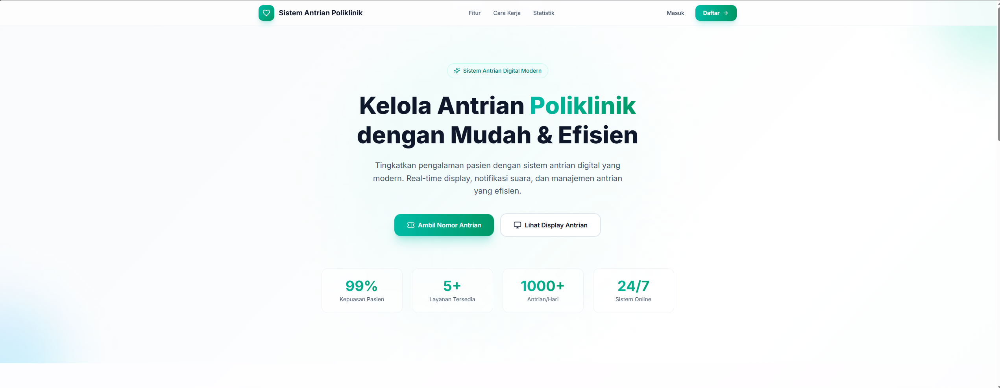
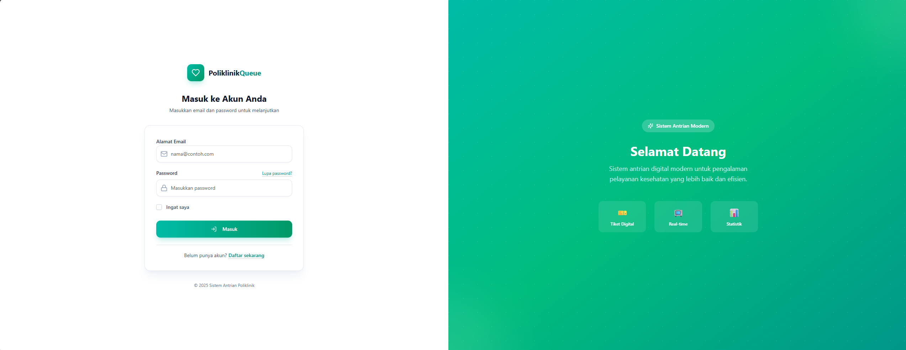
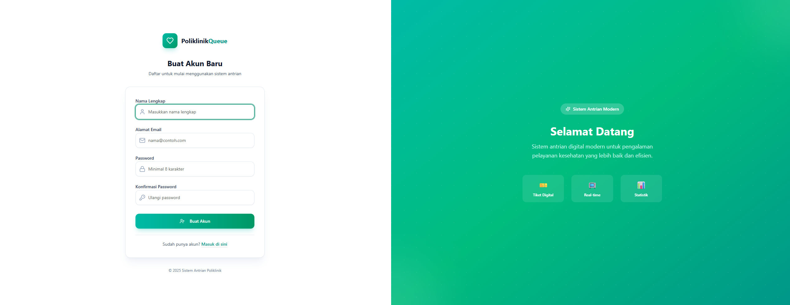
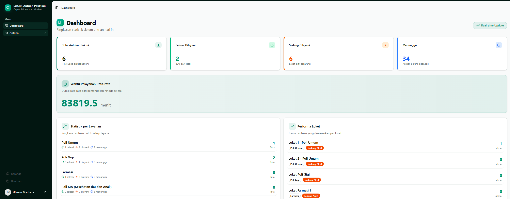
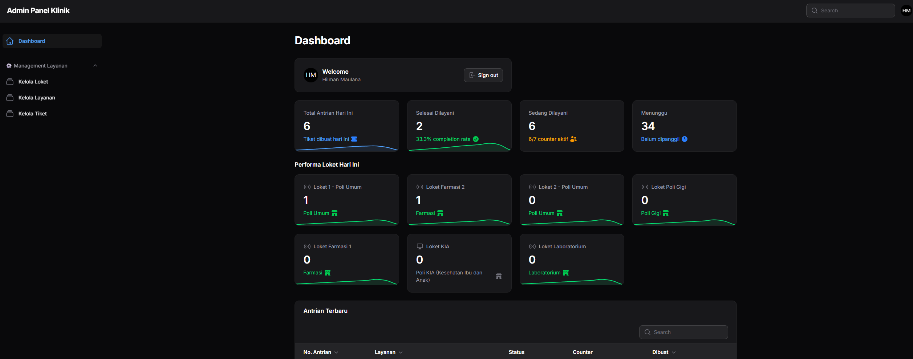
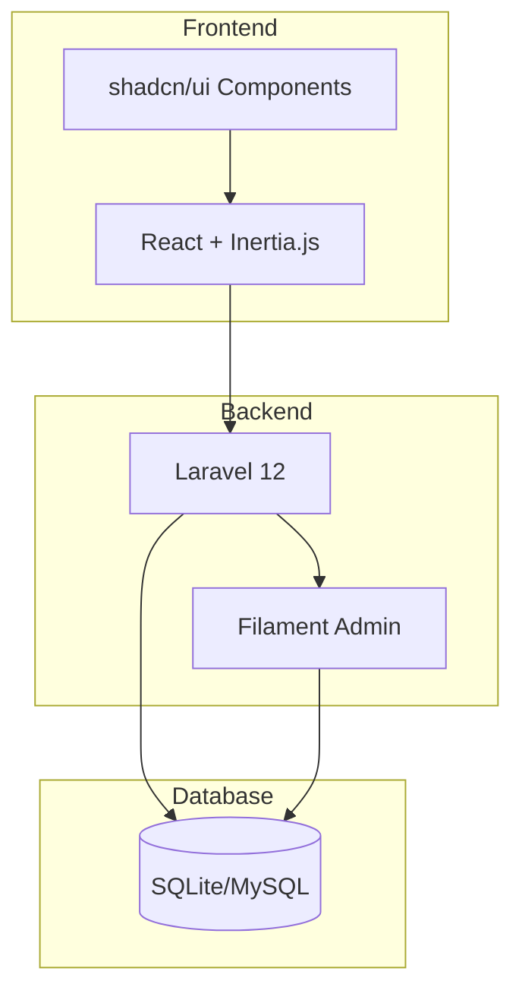

<div align="center">

# 🏥 SALK - Sistem Antrian Loket Klinik

### Solusi Digital untuk Manajemen Antrian Klinik yang Modern, Cepat, dan Efisien

[](https://laravel.com)
[](https://react.dev)
[](https://www.typescriptlang.org/)
[](https://tailwindcss.com)
[](https://filamentphp.com)

</div>

---

## 👨‍💻 Tim Pengembang

Proyek ini dikembangkan oleh mahasiswa **Teknik Informatika, UIN Sunan Gunung Djati Bandung**:

| Nama | NIM | Role |
|------|-----|------|
| M Dantha Arianvasya | 1237050106 | Project Manager |
| Muhamad Khansa Khalifaturohman | 1247050115 | System Analyst |
| Hasna Minatul Mardiah | 1237050024 | UI/UX Designer |
| Idha Hamidaturrosadi | 1237050026 | UI/UX Designer |
| Hilman Maulana | 1237050020 | Frontend Developer |
| Irsyad Adfiansha Hidayat | 1237050042 | Frontend Developer |
| Lutfi Nurhidayat | 1237050123 | Backend Developer |
| Hafizultan Fanzaulid | 1237050097 | Backend Developer |
| Firman Adi Nugraha | 1237050016 | Quality Assurance |

---

## 📋 Deskripsi Proyek

**SALK (Sistem Antrian Loket Klinik)** adalah aplikasi web modern untuk mengelola antrian pasien di loket klinik/poliklinik secara digital. Sistem ini memungkinkan pasien mengambil nomor antrian secara mandiri, memantau status secara real-time, dan membantu petugas mengelola pelayanan dengan lebih efisien.

Proyek ini dikembangkan sebagai bagian dari **Tugas Manajemen Proyek Perangkat Lunak** - Ujian Tengah Semester Ganjil Tahun Akademik 2025/2026.

---

## ✨ Fitur Utama

### 👥 Modul Pasien
- 🎫 **Ambil Tiket Antrian** - Pasien dapat mengambil nomor antrian secara mandiri
- ⏱️ **Estimasi Waktu Tunggu** - Menampilkan perkiraan waktu dilayani berdasarkan rata-rata pelayanan
- 📺 **Display Real-Time** - Tampilan layar besar untuk menunjukkan antrian aktif
- 🖨️ **Cetak Tiket** - Fitur cetak tiket dengan desain profesional

### 👨‍💼 Modul Operator/Petugas
- 📞 **Panel Operator** - Dashboard untuk memanggil dan mengelola antrian
- 🔁 **Panggil Ulang** - Fitur untuk memanggil ulang pasien
- ✅ **Selesai & Panggil Berikutnya** - Alur kerja yang efisien
- 📊 **Statistik Harian** - Melihat jumlah pasien yang sudah dilayani

### 🔧 Modul Admin (Filament Panel)
- 👤 **Manajemen Pengguna** - Kelola akun admin dan petugas
- 🏥 **Manajemen Layanan** - Atur poli/layanan dengan prefix tiket
- 🖥️ **Manajemen Loket** - Konfigurasi counter pelayanan
- 📈 **Laporan Aktivitas** - Statistik dan analisis pelayanan

---

## 🛠️ Tech Stack

| Layer | Teknologi |
|-------|-----------|
| **Frontend** | React 19, TypeScript, Inertia.js 2, Tailwind CSS 4 |
| **UI Components** | shadcn/ui, Radix UI, Lucide React |
| **Backend** | Laravel 12, PHP 8.2+ |
| **Admin Panel** | Filament 4 |
| **Database** | SQLite (default), MySQL/PostgreSQL (production) |
| **Build Tool** | Vite 7 |
| **Design** | Figma |

---

## 📸 Screenshots

<div align="center">
    
    <p>Landing Page</p>
</div>

<div align="center">
     <div style="display: flex; justify-content: center; gap: 10px;">
        
        
    </div>
     <p>Login & Register</p>
</div>

<div align="center">
    
    <p>Dashboard User</p>
</div>

<div align="center">
    
    <p>Dashboard Admin</p>
</div>

---

## 🚀 Instalasi

### Prasyarat
- PHP >= 8.2
- Composer
- Node.js >= 18
- NPM atau Yarn

### Langkah Instalasi

```bash
# 1. Clone repository
git clone https://github.com/[username]/salk.git
cd salk

# 2. Install dependencies PHP
composer install

# 3. Install dependencies JavaScript
npm install

# 4. Copy environment file
cp .env.example .env

# 5. Generate application key
php artisan key:generate

# 6. Setup database (SQLite)
touch database/database.sqlite
php artisan migrate --seed

# 7. Build assets
npm run build

# 8. Jalankan server
php artisan serve
```

### Akses Aplikasi

| URL | Deskripsi |
|-----|-----------|
| `http://localhost:8000` | Landing Page |
| `http://localhost:8000/login` | Login User |
| `http://localhost:8000/admin/login` | Login Admin |
| `http://localhost:8000/queue/ticket` | Ambil Tiket Antrian |
| `http://localhost:8000/queue/display` | Display Antrian |
| `http://localhost:8000/queue/management` | Panel Operator |
| `http://localhost:8000/admin` | Admin Panel (Filament) |

---


## 📅 Timeline Proyek

| Sprint | Fase | Durasi | Status |
|--------|------|--------|--------|
| - | Pembagian Tugas | 1 - 7 September 2025 | ✅ Selesai |
| 1 | Perancangan & Desain | 8 - 28 September 2025 | ✅ Selesai |
| 2 | Pengembangan Fitur Utama | 29 Sept - 26 Okt 2025 | ✅ Selesai |
| 3 | Integrasi & Penyempurnaan | 27 Okt - 30 Nov 2025 | ✅ Selesai |
| - | Testing | 1 - 14 Desember 2025 | ✅ Selesai |
| - | Deploy & Evaluasi | 15 - 28 Desember 2025 | ⏳ Pending |

---

## 📊 Arsitektur Sistem



### Entitas Database
- **Users** - Data pengguna (admin, petugas)
- **Services** - Data layanan/poli
- **Counters** - Data loket pelayanan
- **Tickets** - Data tiket antrian
- **Calls** - Riwayat pemanggilan

---

## 📄 Lisensi

Proyek ini dikembangkan untuk keperluan akademis dan pembelajaran.

---

## 🙏 Acknowledgments

- **UIN Sunan Gunung Djati Bandung** - Fakultas Sains dan Teknologi
- **Jurusan Teknik Informatika** - Mata Kuliah MPPL
- **Agung Wahana, MT.** - Dosen Pengampu Mata Kuliah MPPL

---

<div align="center">

**SALK - Sistem Antrian Loket Klinik**

*Cepat, Efisien, dan Modern*

Made with ❤️ by Tim SALK - UIN Sunan Gunung Djati Bandung © 2025

</div>
